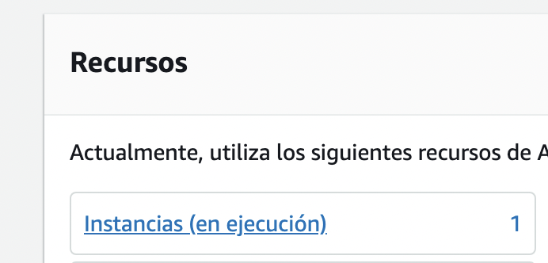
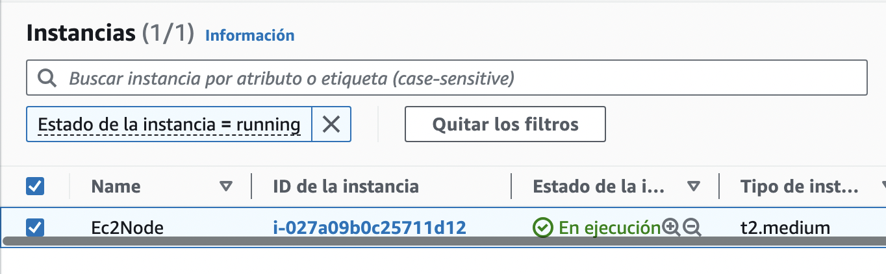
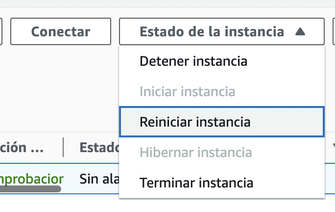

Reboot automático de Nodo Bitcoin y LND
===

En esta sección vamos a crear un **shell script** para indicarle al servidor que cada que inice el servidor (es decir si se reinicia, se apaga por algún error y prende automáticamente), inicie primero el nodo de bitcoin, espere unos momentos y después inicie el nodo LND.

Así que vamos a crear un archivo `.sh` en nuestra carpeta `nodes` con el siguiente comando:

```bash
$ nano ~/nodes/start_nodes.sh
```

Y vamos a agregar la siguiente información:

```bash
# create bitcoind alias
bitcoind="$HOME/nodes/bitcoin/bitcoin-25.0/bin/bitcoind"
# inform log your status
echo "starting bitcoin daemon"
# run bitcoin node
$bitcoind -testnet -daemon
# wait 30 seconds
sleep 30
# create lnd alias
lnd="$HOME/nodes/lnd/lnd-linux-amd64-v0.16.4-beta/lnd"
# inform log your status
echo "starting lnd"
# run lnd node
$lnd
```

> ¡ATENCIÓN! Recuerda cambiar la ruta de los binarios en la información anterior por las versiones que estás utilizando o no funcionará.

Ahora vamos a abrir nuestro crontab para actualizar el comando que teníamos para iniciar únicamente el nodo de bitcoin y colocar el script .sh que acabamos de crear.

```bash
$ crontab -e
```

Y cambiamos el comando que habíamos agregado en el paso 3 "Instalación del Nodo Bitcoin" por el siguiente:

```bash
@reboot bash ~/nodes/start_nodes.sh 2> ~/nodes/err.log &
```

Ahora cuando se reinicie por cualquier razón nuestra instancia, el servidor conoce los pasos que debe seguir para dejar corriendo nuestro nodo bitcoin y LND. 

Si por alguna razón  no funciona, podrás revisar lo que sucedió al momento de correr el script en el archivo `nodes/err.log`.

Para probarlo vamos a reiniciar la instancia de AWS entrando a la sección de EC2. 

 
*<sub>Imagen 1</sub>*

Click en **Instancias (en ejecución)** (Imagen 1).


*<sub>Imagen 2</sub>*

Seleccionamos nuestra instancia (Imagen 2), y vamos al menú desplegable **"Estado de la instancia"** y damos click en **"Reiniciar instancia"** (Imagen 3)


*<sub>Imagen 3</sub>*

Ahora debemos esperar unos minutos a que nuestra instancia vuelva a iniciar y realice todo el proceso esperado.

Si intentas conectarte a tu instancia y te manda un error de `timeout` significa que aún no termina de reiniciarse y debes esperar unos minutos más.

Después de unos minutos, nos volvemos a conectar y podemos comprobar que está corriendo el nodo de bitcoin y LND si revisamos sus logs utilizando el comando `tail -f` como en los siguientes ejemplos.

Primero revisa el log de bitcoin primero y verifica que no marque errores o que se detuvo
```bash
$ tail -f bitcoind-testnet.log
```

Ahora verifica que LND esté corriendo utilizando su log.
```bash
$ tail -f lnd-testnet.log
```

Si todo se ve en orden podrémos probar utilizar nuestro nodo LND con el comando para mostrar su información

```bash
$ lncli --network=testnet getinfo
```

En la siguiente sección fondearemos nuestro nodo, crearemos canales y realizaremos el pago de una invoice para aprender a utilizar los comandos de `lncli`.